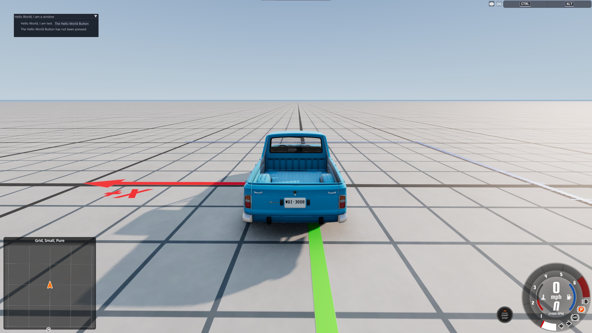

!!! warning "Ce site est en cours de construction !"

```
Ce site est actuellement en cours de développement.

Vous pensez pouvoir contribuer ? Cliquez simplement sur l'icône en forme de crayon située à droite de la page !

Vous pouvez également contribuer à n'importe quelle autre page.
```

# Créer une fenêtre ImGui

Cette page explique comment créer une fenêtre ImGui basique.

## Configuration

Avant d'utiliser ImGui, une petite configuration est nécessaire :

```lua
local im = ui_imgui -- raccourci pour éviter de rechercher ui_imgui à chaque utilisation. Cela peut aider à optimiser les performances.
local imguiExampleWindowOpen = im.BoolPtr(true)
```

`imguiExampleWindowOpen` sera utilisé pour déterminer si la fenêtre d'exemple doit être affichée.

## Affichage de la fenêtre

Les fenêtres ImGui ainsi que leur contenu doivent être recréés à chaque image où elles doivent être affichées. Il est donc nécessaire d'utiliser une fonction `onUpdate` ou un mécanisme similaire.

```lua
local function onUpdate()
    if worldReadyState == 2 then
        if imguiExampleWindowOpen[0] == true then
            imguiExample()
        end
    end
end

M.onUpdate = onUpdate
```

Cette fonction exécutera `imguiExample()` pour créer la fenêtre d'exemple, à condition que le niveau soit complètement chargé et que la fenêtre soit configurée pour être visible.

## Contenu de la fenêtre

Si vous débutez avec ImGui, vous pouvez le considérer comme un lointain cousin du HTML :

* `im.SetNextWindowSize(im.ImVec2(x, y), im.Cond_FirstUseEver)` définit la taille de la fenêtre si celle-ci n'a pas encore été configurée.
* `im.Begin()` et `im.End()` correspondent approximativement à `<body>` et `</body>`.
* `im.Text()` correspond approximativement à `<p></p>`.

```lua
local buttonPresses = 0

local function imguiExample()
    im.SetNextWindowSize(im.ImVec2(366, 100), im.Cond_FirstUseEver) -- prépare notre fenêtre

    im.Begin("Bonjour, je suis une fenêtre") -- crée une fenêtre avec ce titre

        im.Indent() -- ajoute un retrait

            im.Text("Bonjour, je suis du texte.") -- ajoute une ligne de texte, similaire à un élément <p>

            im.SameLine() -- permet de placer l'élément suivant sur la même ligne

            if im.Button("Le bouton Bonjour") then -- similaire à <button>. Exécute du code Lua lorsqu'il est pressé.
                buttonPresses = buttonPresses + 1
            end

            if buttonPresses > 0 then
                im.Text("Le bouton Bonjour a été utilisé " .. buttonPresses .. " fois !")
            else
                im.Text("Le bouton Bonjour n'a pas encore été utilisé.")
            end

        im.Unindent() -- termine le retrait

    im.End() -- termine la fenêtre afin qu'elle puisse être affichée
end
```

Vous pouvez également ajouter la fonction suivante afin de pouvoir facilement afficher ou masquer la fenêtre :

```lua
local function toggleExampleImgui()
    imguiExampleWindowOpen[0] = not imguiExampleWindowOpen[0]
end
```

## Résultat

<figure class="image image_resized" style="width:100%" markdown>
  
</figure>

Lorsque vous appuyez sur le bouton **Le bouton Bonjour**, le compteur situé en dessous est mis à jour afin d'afficher le nombre de fois où le bouton a été utilisé.

## Téléchargement

Ce tutoriel est presque entièrement basé sur le mod d'exemple ImGui de [StanleyDudek](https://github.com/StanleyDudek).

Vous pouvez télécharger le mod d'exemple ici :

[**Télécharger l'exemple ImGui**](../../../../assets/content/imguiExample.zip)
